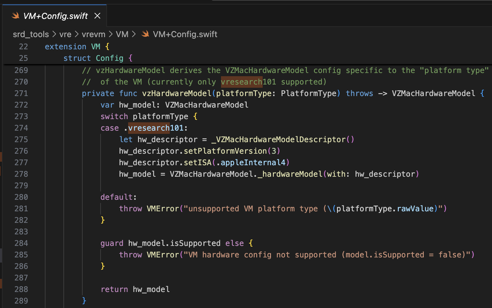
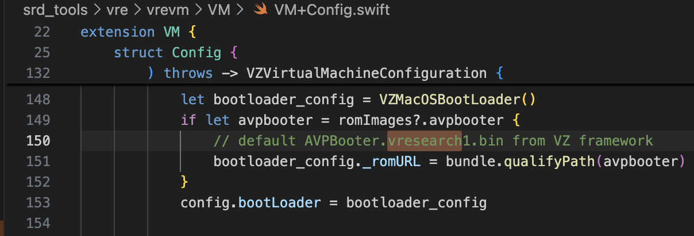
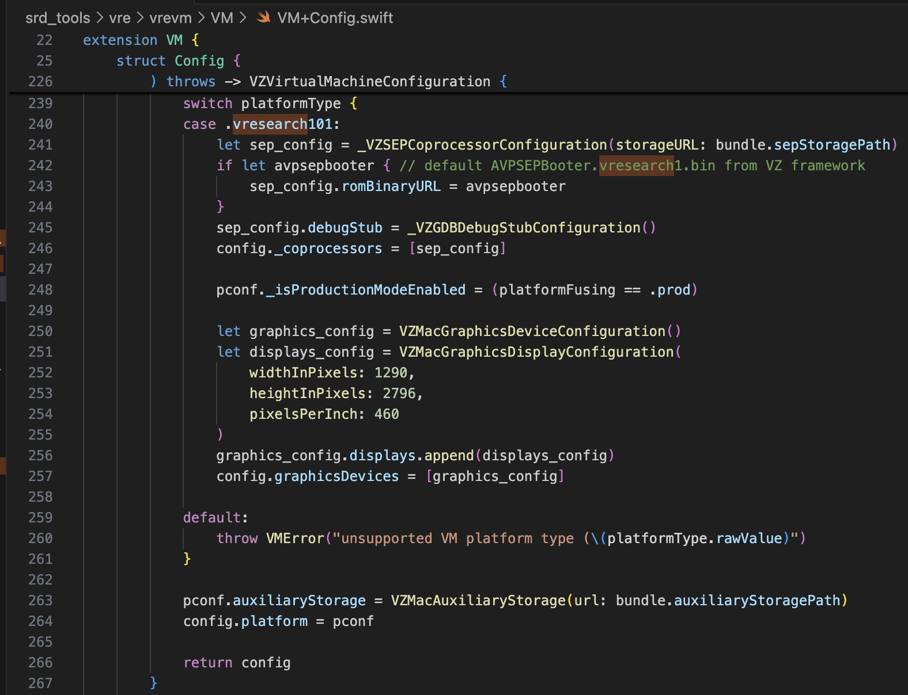
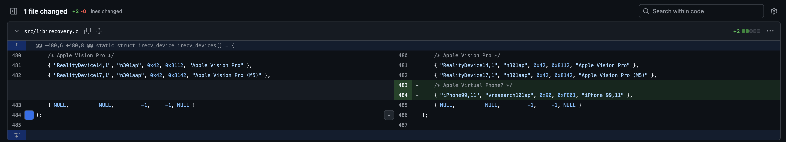
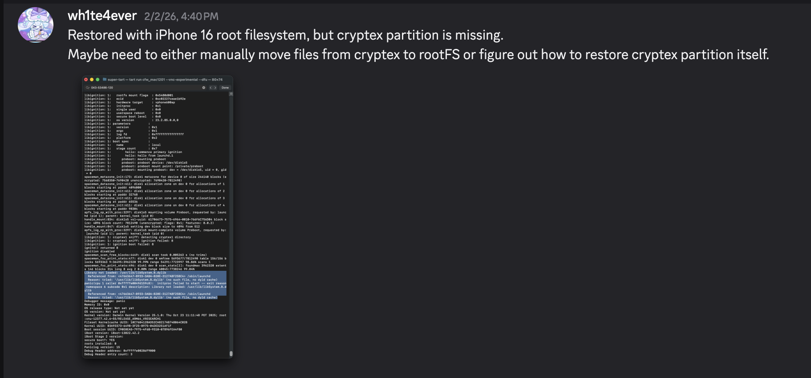
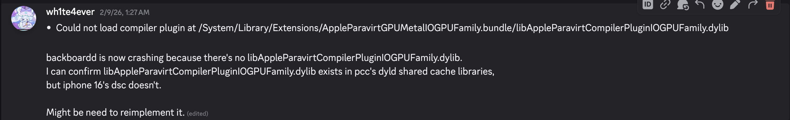

# Building virtual iPhone using VPHONE600AP component of recently released PCC firmware

# Project has been now open-sourced
https://github.com/wh1te4ever/super-tart-vphone

# Special Thanks / Acknowledgements

- [dlevi309](https://github.com/dlevi309) (Provided ideas for touch interaction on virtual iPhone)
- [khanhduytran0](https://github.com/khanhduytran0), [34306](https://github.com/34306), [asdfugil](https://github.com/asdfugil), [verygenericname](https://github.com/verygenericname) (Provided other ideas for building virtual iPhone, including Cryptex, Device Activation, Ramdisk booting, etc.)
- [ma4the](https://github.com/ma4the), [Mard](https://github.com/Mardcelo), [SwallowS](https://github.com/swollows) (Testing if works well on other environment)

# Motivation

Around late 2024, Apple began introducing [Private Cloud Compute](https://security.apple.com/blog/private-cloud-compute/), claiming to open new horizon for cloud-based AI privacy. Then, around late 2025, some interesting news appeared: Apple had newly added vphone600ap-related components to PCC firmware, starting with cloudOS 26.

](contents/image.png)

Source: [https://x.com/matteyeux/status/2006339694783848660/photo/1](https://x.com/matteyeux/status/2006339694783848660/photo/1)

**"iPhone Research Environment Virtual Machine”?**

Is this a planned move by Apple to build and distribute a virtual iPhone environment for other security researchers in the future, or was it simply a mistake? Given that DEVELOPMENT/KASAN build kernel was once discovered in the iOS 15.0 beta to 15.1 beta3 OTAs back in 2021, the possibility of a slip-up cannot be ruled out. At that time, the kernel remained included for about 4 months, roughly from June to October 2021.

Then, around January of this year, a tweet was posted showing a virtual iPhone booting up utilizing these vphone600ap-related components.

](contents/Screenshot_2026-02-24_at_7.37.31_PM.png)

Source: [https://x.com/_inside/status/2008951845725548783](https://x.com/_inside/status/2008951845725548783)


From what I saw, almost everything worked truly elegantly. Compared to the [QEMUAppleSilicon(Inferno) project](https://github.com/ChefKissInc/Inferno) I had seen previously, it runs much snappier and smoother. Furthermore, it even appeared to support Metal acceleration. Ultimately, completely captivated by it, I dove right in and started building my own virtual iPhone on January 31st.


# **Modifying super-tart to boot virtual iPhone**

The referenced project is [security-pcc](https://github.com/apple/security-pcc). It corresponds to the source code of the /System/Library/SecurityResearch/usr/bin/vrevm binary. An interesting point is that it uses private methods provided by Virtualization.framework. In the virtual machine used for PCC research, you can see that the ISA and PlatformVersion are explicitly specified during the hardware model initialization process.



For the bootrom, AVPBooter.vresearch1.bin is used (/System/Library/Frameworks/Virtualization.framework/Resources/AVPBooter.vresearch1.bin)



and for the SEPROM (avpsepbooter), AVPSEPBooter.vresearch1.bin is used, which separately loads a SEPStorage file that functions similarly to [AuxiliaryStorage](https://developer.apple.com/documentation/virtualization/vzmacplatformconfiguration/auxiliarystorage).
(/System/Library/Frameworks/Virtualization.framework/Versions/A/Resources/AVPSEPBooter.vresearch1.bin)

Another interesting point is that if you look at the code for setting the resolution, it is set to 1290x2796, which corresponds to the iPhone 14 Pro Max, 15 Plus, 15 Pro Max, and 16 Plus devices.



With just this information, it should be more than enough to modify [super-tart](https://github.com/JJTech0130/super-tart) to boot the virtual iPhone. I made the modifications as shown below.

- /Sources/tart/VM.swift

```swift
...
class VM: NSObject, VZVirtualMachineDelegate, ObservableObject {
...
  // vzHardwareModel derives the VZMacHardwareModel config specific to the "platform type"
  // of the VM (currently only vresearch101 supported)
  static private func vzHardwareModel_VRESEARCH101() throws -> VZMacHardwareModel {
    var hw_model: VZMacHardwareModel

    guard let hw_descriptor = _VZMacHardwareModelDescriptor() else {
      fatalError("Failed to create hardware descriptor")
    }
    hw_descriptor.setPlatformVersion(3) // .appleInternal4 = 3
    hw_descriptor.setBoardID(0x90)
    hw_descriptor.setISA(2)
    hw_model = VZMacHardwareModel._hardwareModel(withDescriptor: hw_descriptor)

    guard hw_model.isSupported else {
        fatalError("VM hardware config not supported (model.isSupported = false)")
    }

    return hw_model
  }

  static func craftConfiguration(
    diskURL: URL,
    nvramURL: URL,
    romURL: URL,
    sepromURL: URL? = nil,
    vmConfig: VMConfig,
    network: Network = NetworkShared(),
    additionalStorageDevices: [VZStorageDeviceConfiguration],
    directorySharingDevices: [VZDirectorySharingDeviceConfiguration],
    serialPorts: [VZSerialPortConfiguration],
    suspendable: Bool = false,
    nested: Bool = false,
    audio: Bool = true,
    clipboard: Bool = true,
    sync: VZDiskImageSynchronizationMode = .full,
    caching: VZDiskImageCachingMode? = nil
  ) throws -> VZVirtualMachineConfiguration {
    let configuration: VZVirtualMachineConfiguration = .init()

    // Boot loader
    let bootloader = try vmConfig.platform.bootLoader(nvramURL: nvramURL)
    Dynamic(bootloader)._setROMURL(romURL)
    configuration.bootLoader = bootloader

    // SEP ROM
    let homeURL = FileManager.default.homeDirectoryForCurrentUser
    var sepstoragePath = homeURL.appendingPathComponent(".tart/vms/vphone/SEPStorage").path
    let sepstorageURL = URL(fileURLWithPath: sepstoragePath)
    let sep_config = Dynamic._VZSEPCoprocessorConfiguration(storageURL: sepstorageURL)
    if let sepromURL { // default AVPSEPBooter.vresearch1.bin from VZ framework
        sep_config.romBinaryURL = sepromURL
    }
    sep_config.debugStub = Dynamic._VZGDBDebugStubConfiguration(port: 8001)
    configuration._setCoprocessors([sep_config.asObject])
    
    // Some vresearch101 config
    let pconf = VZMacPlatformConfiguration()
    pconf.hardwareModel = try vzHardwareModel_VRESEARCH101()

    let serial = Dynamic._VZMacSerialNumber.initWithString("AAAAAA1337")
    let identifier = Dynamic.VZMacMachineIdentifier._machineIdentifierWithECID(0x1111111111111111, serialNumber: serial.asObject)
    pconf.machineIdentifier = identifier.asObject as! VZMacMachineIdentifier

    pconf._setProductionModeEnabled(true)
    var auxiliaryStoragePath = homeURL.appendingPathComponent(".tart/vms/vphone/nvram.bin").path
    let auxiliaryStorageURL = URL(fileURLWithPath: auxiliaryStoragePath)
    pconf.auxiliaryStorage = VZMacAuxiliaryStorage(url: auxiliaryStorageURL)

    if #available(macOS 14, *) {
      let keyboard = VZUSBKeyboardConfiguration()
      configuration.keyboards = [keyboard]
    }

    if #available(macOS 14, *) {
      let touch = _VZUSBTouchScreenConfiguration()
      configuration._setMultiTouchDevices([touch])
    }
    ...
    configuration.platform = pconf

    // Display
    let graphics_config = VZMacGraphicsDeviceConfiguration()
    let displays_config = VZMacGraphicsDisplayConfiguration(
        widthInPixels: 1179,
        heightInPixels: 2556,
        pixelsPerInch: 460
    )
    graphics_config.displays.append(displays_config)
    configuration.graphicsDevices = [graphics_config]
 ...   
```

# Modifying the Firmware

The referenced project is [vma2pwn](https://github.com/nick-botticelli/vma2pwn). Specifically for version 12.0.1, it boots a Mac virtual machine with almost the entire bootchain modified.

Let's look at the [prepare.sh](https://github.com/nick-botticelli/vma2pwn/blob/main/prepare.sh) script first. It extracts firmware components, such as the bootloader and kernel compressed in IM4P format, into RAW format and patches instructions/data at specific hardcoded addresses. RestoreRamdisk is the root filesystem used when restoring the firmware, and AVPBooter is the BootROM used in the virtual machine.

To summarize, it extracts the individual files included in the firmware and patches integrity checks to allow the restoration of custom firmware, or modifies the boot-args parameters to make it easier to view boot-related logs.

Finally, [vma2pwn.sh](https://github.com/nick-botticelli/vma2pwn/blob/main/vma2pwn.sh) is responsible for restoring the custom firmware. It does this by entering DFU mode beforehand. Here, the virtual machine uses something called super-tart. This is a version of the existing tart virtual machine with added features like a custom bootrom, serial output, DFU mode, and GDB debugging. (Note that SIP/AMFI must be disabled for this to work.)

I have used it quite usefully recently while I [studying XNU kernel 1-day vulnerabilities (CVE-2021-30937, CVE-2021-30955)](https://github.com/wh1te4ever/xnu_1day_practice). It is fantastic because it supports live kernel debugging.

## Building Custom Firmware

I mixed the components of cloudOS 26.1 (23B85) and iOS 26.1 (iPhone17,3; 23B85), uh,,, but... I can't remember the exact details. To be precise, I had to properly mix the iPhone 16 and vphone-related components to create the custom firmware, but I've forgotten exactly which ones I ended up mixing. From what I recall:

- BuildManifest.plist:
I modified the dictionary elements under the Manifest key. I configured it so that during the restore process, the SystemVolume, SystemVolumeCanonicalMetadata, OS, StaticTrustCache, RestoreTrustCache, and RestoreRamDisk from iPhone 16(iOS 26.1) model would be used. The rest were set up to use vphone-related files from PCC firmware.
- Restore.plist:
I believe I added properties related to DeviceMap or SupportedProductTypes, or changed the SystemRestoreImageFileSystems element.

The files below are the final result of my mix.

[Restore.plist](contents/Restore.plist)

[BuildManifest.plist](contents/BuildManifest.plist)

- get_fw.py (Partial)

```python
...

# 3. Import things from cloudOS
# kernelcache
os.system("cp 399b664dd623358c3de118ffc114e42dcd51c9309e751d43bc949b98f4e31349_extracted/kernelcache.* iPhone17,3_26.1_23B85_Restore")
# agx, all_flash, ane, dfu, pmp...
os.system("cp 399b664dd623358c3de118ffc114e42dcd51c9309e751d43bc949b98f4e31349_extracted/Firmware/agx/* iPhone17,3_26.1_23B85_Restore/Firmware/agx")
os.system("cp 399b664dd623358c3de118ffc114e42dcd51c9309e751d43bc949b98f4e31349_extracted/Firmware/all_flash/* iPhone17,3_26.1_23B85_Restore/Firmware/all_flash")
os.system("cp 399b664dd623358c3de118ffc114e42dcd51c9309e751d43bc949b98f4e31349_extracted/Firmware/ane/* iPhone17,3_26.1_23B85_Restore/Firmware/ane")
os.system("cp 399b664dd623358c3de118ffc114e42dcd51c9309e751d43bc949b98f4e31349_extracted/Firmware/dfu/* iPhone17,3_26.1_23B85_Restore/Firmware/dfu")
os.system("cp 399b664dd623358c3de118ffc114e42dcd51c9309e751d43bc949b98f4e31349_extracted/Firmware/pmp/* iPhone17,3_26.1_23B85_Restore/Firmware/pmp")
# sptm, txm, etc...
os.system("cp 399b664dd623358c3de118ffc114e42dcd51c9309e751d43bc949b98f4e31349_extracted/Firmware/*.im4p iPhone17,3_26.1_23B85_Restore/Firmware")

# 4. TODO: parse what things needed from BuildManifest.plist, Restore.plist in cloudOS 26.1
# It will be really complicated, so import things from already parse completed
os.system("sudo cp custom_26.1/BuildManifest.plist iPhone17,3_26.1_23B85_Restore")
os.system("sudo cp custom_26.1/Restore.plist iPhone17,3_26.1_23B85_Restore")

os.system("echo 'Done, grabbed all needed components for restoring'")
```

## Patch AVPBooter.vresearch1.bin

I referenced [that post](https://gist.github.com/steven-michaud/fda019a4ae2df3a9295409053a53a65c#iboot-stage-0-avpbootervmapple2binorg). You must patch `image4_validate_property_callback` in order to load  custom bootloader afterward. Simply use "Text-search (slow!)" feature in IDA Pro to search for "0x4447", and patch the epilogue of the corresponding function to always return 0.


## Modifying and Building libirecovery

Before restoring the firmware, a few modifications were necessary to support the vresearch101ap model. Once built, firmware restoration becomes possible using the [idevicerestore](https://github.com/libimobiledevice/idevicerestore) tool.

[https://github.com/wh1te4ever/libirecovery](https://github.com/wh1te4ever/libirecovery)



## **Patching Firmware Components**

Similar to AVPBooter, the bootloaders used for restoration, iBSS and iBEC, were patched to bypass signature verification. I also enabled serial log output so that if there are any booting issues, the cause can be identified immediately.

As you will see later, bypassing [SSV (Signed System Volume) verification](https://support.apple.com/fr-lu/guide/security/secd698747c9/web) is required to load an arbitrary Cryptex. This is performed in the LLB, which is loaded when booting in normal mode rather than DFU mode, and verification is also sometimes performed in the kernel.

Additionally, I patched the TXM so that even if a binary/library is not registered in the Trustcache, it is recognized as if it were.

- patch_fw.py (Partial content, Part 1)

```python
# Patch iBSS
# patch image4_validate_property_callback
patch(0x9D10, 0xd503201f)   #nop
patch(0x9D14, 0xd2800000)   #mov x0, #0

# Patch iBEC
# patch image4_validate_property_callback
patch(0x9D10, 0xd503201f)   #nop
patch(0x9D14, 0xd2800000)   #mov x0, #0
# patch boot-args with "serial=3 -v debug=0x2014e %s"
patch(0x122d4, 0xd0000082)  #adrp x2, #0x12000
patch(0x122d8, 0x9101c042)  #add x2, x2, #0x70
patch(0x24070, "serial=3 -v debug=0x2014e %s")

# Patch LLB
# patch image4_validate_property_callback
patch(0xA0D8, 0xd503201f)   #nop
patch(0xA0DC, 0xd2800000)   #mov x0, #0
# patch boot-args with "serial=3 -v debug=0x2014e %s"
patch(0x12888, 0xD0000082)  #adrp x2, #0x12000
patch(0x1288C, 0x91264042)  #add x2, x2, #0x990
patch(0x24990, "serial=3 -v debug=0x2014e %s")
# make possible load edited rootfs (needed to command snaputil -n later)
patch(0x2BFE8, 0x1400000b)
patch(0x2bca0, 0xd503201f)
patch(0x2C03C, 0x17ffff6a)
patch(0x2fcec, 0xd503201f)
patch(0x2FEE8, 0x14000009)
# some unknown patch, bypass panic
patch(0x1AEE4, 0xd503201f)  #nop

# 6. Grab & Patch TXM
# Patch TXM for make running binary which is not registered in trustcache
# TXM [Error]: CodeSignature: selector: 24 | 0xA8 | 0x30 | 1
# Some trace: FFFFFFF01702B018->sub_FFFFFFF0170306E4->sub_FFFFFFF01703059C->sub_FFFFFFF01703037C->sub_FFFFFFF017030164->sub_FFFFFFF01702EC70 (base: 0xFFFFFFF017004000)
patch(0x2c1f8, 0xd2800000)      #FFFFFFF0170301F8
patch(0x2bef4, 0xd2800000)      #FFFFFFF01702FEF4
patch(0x2c060, 0xd2800000)      #FFFFFFF017030060

# 7. Grab & patch kernelcache
# ========= Bypass SSV =========
# _apfs_vfsop_mount: Prevent panic "Failed to find the root snapshot. Rooting from the live fs ..."
patch(0x2476964, 0xd503201f)  #FFFFFE000947A964
# _authapfs_seal_is_broken: Prevent panic "root volume seal is broken ..."
patch(0x23cfde4, 0xd503201f) #FFFFFE00093D3DE4 
# _bsd_init: Prevent panic "rootvp not authenticated after mounting ..."
patch(0xf6d960, 0xd503201f)    #FFFFFE0007F71960
...
```

After converting to the RAW format and patching it, you need to convert it back to IM4P.
In the case of the kernel or TXM, a PAYP structure exists, so it was necessary to preserve that structure.
Below is the code that converts IM4P → RAW → IM4P using [pyimg4](https://pypi.org/project/pyimg4/), [img4tool](https://github.com/tihmstar/img4tool), [img4](https://github.com/xerub/img4lib) tool.

- patch_fw.py (Partial content, Part 2)

```python
...

# Patch iBSS
if not os.path.exists("iPhone17,3_26.1_23B85_Restore/Firmware/dfu/iBSS.vresearch101.RELEASE.im4p.bak"):
    os.system("cp iPhone17,3_26.1_23B85_Restore/Firmware/dfu/iBSS.vresearch101.RELEASE.im4p iPhone17,3_26.1_23B85_Restore/Firmware/dfu/iBSS.vresearch101.RELEASE.im4p.bak")
os.system("tools/img4 -i iPhone17,3_26.1_23B85_Restore/Firmware/dfu/iBSS.vresearch101.RELEASE.im4p.bak -o iBSS.vresearch101.RELEASE")
... # patch things from raw
os.system("tools/img4tool -c iPhone17,3_26.1_23B85_Restore/Firmware/dfu/iBSS.vresearch101.RELEASE.im4p -t ibss iBSS.vresearch101.RELEASE")

# Patch iBEC
if not os.path.exists("iPhone17,3_26.1_23B85_Restore/Firmware/dfu/iBEC.vresearch101.RELEASE.im4p.bak"):
    os.system("cp iPhone17,3_26.1_23B85_Restore/Firmware/dfu/iBEC.vresearch101.RELEASE.im4p iPhone17,3_26.1_23B85_Restore/Firmware/dfu/iBEC.vresearch101.RELEASE.im4p.bak")
os.system("tools/img4 -i iPhone17,3_26.1_23B85_Restore/Firmware/dfu/iBEC.vresearch101.RELEASE.im4p.bak -o iBEC.vresearch101.RELEASE")
... # patch things from raw
os.system("tools/img4tool -c iPhone17,3_26.1_23B85_Restore/Firmware/dfu/iBEC.vresearch101.RELEASE.im4p -t ibec iBEC.vresearch101.RELEASE")

# Patch LLB
if not os.path.exists("iPhone17,3_26.1_23B85_Restore/Firmware/all_flash/LLB.vresearch101.RESEARCH_RELEASE.im4p.bak"):
    os.system("cp iPhone17,3_26.1_23B85_Restore/Firmware/all_flash/LLB.vresearch101.RESEARCH_RELEASE.im4p iPhone17,3_26.1_23B85_Restore/Firmware/all_flash/LLB.vresearch101.RESEARCH_RELEASE.im4p.bak")
os.system("tools/img4 -i iPhone17,3_26.1_23B85_Restore/Firmware/all_flash/LLB.vresearch101.RESEARCH_RELEASE.im4p.bak -o LLB.vresearch101.RESEARCH_RELEASE")
... # patch things from raw
os.system("tools/img4tool -c iPhone17,3_26.1_23B85_Restore/Firmware/all_flash/LLB.vresearch101.RESEARCH_RELEASE.im4p -t illb LLB.vresearch101.RESEARCH_RELEASE")

# 6. Grab & Patch TXM
if not os.path.exists("iPhone17,3_26.1_23B85_Restore/Firmware/txm.iphoneos.research.im4p.bak"):
    os.system("cp iPhone17,3_26.1_23B85_Restore/Firmware/txm.iphoneos.research.im4p iPhone17,3_26.1_23B85_Restore/Firmware/txm.iphoneos.research.im4p.bak")
os.system("pyimg4 im4p extract -i iPhone17,3_26.1_23B85_Restore/Firmware/txm.iphoneos.research.im4p.bak -o txm.raw")
... # patch things from raw
#create im4p
os.system("pyimg4 im4p create -i txm.raw -o txm.im4p -f trxm --lzfse")
# preserve payp structure
txm_im4p_data = Path('iPhone17,3_26.1_23B85_Restore/Firmware/txm.iphoneos.research.im4p.bak').read_bytes()
payp_offset = txm_im4p_data.rfind(b'PAYP')
if payp_offset == -1:
    print("Couldn't find payp structure !!!")
    sys.exit()

with open('txm.im4p', 'ab') as f:
    f.write(txm_im4p_data[(payp_offset-10):])

payp_sz = len(txm_im4p_data[(payp_offset-10):])
print(f"payp sz: {payp_sz}")

txm_im4p_data = bytearray(open('txm.im4p', 'rb').read())
txm_im4p_data[2:5] = (int.from_bytes(txm_im4p_data[2:5], 'big') + payp_sz).to_bytes(3, 'big')
open('txm.im4p', 'wb').write(txm_im4p_data)
os.system("mv txm.im4p iPhone17,3_26.1_23B85_Restore/Firmware/txm.iphoneos.research.im4p")

# 7. Grab & patch kernelcache
if not os.path.exists("iPhone17,3_26.1_23B85_Restore/kernelcache.research.vphone600.bak"):
    os.system("cp iPhone17,3_26.1_23B85_Restore/kernelcache.research.vphone600 iPhone17,3_26.1_23B85_Restore/kernelcache.research.vphone600.bak")
os.system("pyimg4 im4p extract -i iPhone17,3_26.1_23B85_Restore/kernelcache.research.vphone600.bak -o kcache.raw")
... # patch things from raw
#create im4p
os.system("pyimg4 im4p create -i kcache.raw -o krnl.im4p -f krnl --lzfse")

# preserve payp structure
kernel_im4p_data = Path('iPhone17,3_26.1_23B85_Restore/kernelcache.research.vphone600.bak').read_bytes()
payp_offset = kernel_im4p_data.rfind(b'PAYP')
if payp_offset == -1:
    print("Couldn't find payp structure !!!")
    sys.exit()

with open('krnl.im4p', 'ab') as f:
    f.write(kernel_im4p_data[(payp_offset-10):])

payp_sz = len(kernel_im4p_data[(payp_offset-10):])
print(f"payp sz: {payp_sz}")

kernel_im4p_data = bytearray(open('krnl.im4p', 'rb').read())
kernel_im4p_data[2:5] = (int.from_bytes(kernel_im4p_data[2:5], 'big') + payp_sz).to_bytes(3, 'big')
open('krnl.im4p', 'wb').write(kernel_im4p_data)

os.system("mv krnl.im4p iPhone17,3_26.1_23B85_Restore/kernelcache.research.vphone600")
...

```

# Restoring Firmware

Once everything is ready, let's put the virtual machine into DFU mode and try restoring it.

Below is a screenshot of the panic that occurs if the SEP is not configured properly. If you set it up correctly, it should pass this point without any issues.


After the restore is complete, it reboots automatically.
However, a panic occurs in the launchd process because the /usr/lib/libSystem.B.dylib library is missing. This library is located within the dyld_shared_cache on the Cryptex partition, and for some reason, the Cryptex partition could not be restored. As a temporary workaround, you must create an [SSH Ramdisk](https://github.com/verygenericname/SSHRD_Script) to modify the root file system and inject the necessary files. That is exactly why the patch related to SSV verification was needed.




# Fixing Boot Issue by Booting with SSH Ramdisk

I am going to try fixing the boot failure issue by utilizing the ramdisk used in https://github.com/verygenericname/SSHRD_Script.

To upload and load components like the bootloader or kernel using the [irecovery](https://github.com/libimobiledevice/libirecovery) tool in DFU mode, an IMG4 image is needed, which requires an IM4M file. Therefore, I first fetched shsh file using idevicerestore tool, and then converted it into an IM4M file.

```bash
idevicerestore -e -y ./iPhone17,3_26.1_23B85_Restore -t

mv shsh/[ECID]-iPhone99,11-26.1.shsh shsh/[ECID]-iPhone99,11-26.1.shsh.gz

gunzip shsh/[ECID]-iPhone99,11-26.1.shsh.gz

...

pyimg4 im4m  extract -i shsh/[ECID]-iPhone99,11-26.1.shsh -o vphone.im4m
```

Then, using that IM4M file, I generated several IMG4 files for each of the firmware components used, such as iBSS, iBEC, and the devicetree.

```python
# 1. Grab & Patch iBSS 
if not os.path.exists("iPhone17\\,3_26.1_23B85_Restore/Firmware/dfu/iBSS.vresearch101.RELEASE.im4p.bak"):
    os.system("cp iPhone17\\,3_26.1_23B85_Restore/Firmware/dfu/iBSS.vresearch101.RELEASE.im4p iPhone17\\,3_26.1_23B85_Restore/Firmware/dfu/iBSS.vresearch101.RELEASE.im4p.bak")
os.system("tools/img4 -i iPhone17\\,3_26.1_23B85_Restore/Firmware/dfu/iBSS.vresearch101.RELEASE.im4p.bak -o iBSS.vresearch101.RELEASE")
... # patch things from raw
os.system("tools/img4tool -c iBSS.vresearch101.RELEASE.im4p -t ibss iBSS.vresearch101.RELEASE")
os.system("tools/img4 -i iBSS.vresearch101.RELEASE.im4p -o ./Ramdisk/iBSS.vresearch101.RELEASE.img4 -M ./vphone.im4m")

# 2. Grab & Patch iBEC
if not os.path.exists("iPhone17\\,3_26.1_23B85_Restore/Firmware/dfu/iBEC.vresearch101.RELEASE.im4p.bak"):
    os.system("cp iPhone17\\,3_26.1_23B85_Restore/Firmware/dfu/iBEC.vresearch101.RELEASE.im4p iPhone17\\,3_26.1_23B85_Restore/Firmware/dfu/iBEC.vresearch101.RELEASE.im4p.bak")
os.system("tools/img4 -i iPhone17\\,3_26.1_23B85_Restore/Firmware/dfu/iBEC.vresearch101.RELEASE.im4p -o iBEC.vresearch101.RELEASE")
... # patch things from raw
os.system("tools/img4tool -c iBEC.vresearch101.RELEASE.im4p -t ibec iBEC.vresearch101.RELEASE")
os.system("tools/img4 -i iBEC.vresearch101.RELEASE.im4p -o Ramdisk/iBEC.vresearch101.RELEASE.img4 -M vphone.im4m")

# 3. Grab SPTM
os.system("tools/img4 -i iPhone17\\,3_26.1_23B85_Restore/Firmware/sptm.vresearch1.release.im4p -o Ramdisk/sptm.vresearch1.release.img4 -M vphone.im4m -T sptm")

# 4. Grab devicetree
os.system("tools/img4 -i iPhone17\\,3_26.1_23B85_Restore/Firmware/all_flash/DeviceTree.vphone600ap.im4p -o Ramdisk/DeviceTree.vphone600ap.img4 -M vphone.im4m -T rdtr")

# 5. Grab sep
os.system("tools/img4 -i iPhone17\\,3_26.1_23B85_Restore/Firmware/all_flash/sep-firmware.vresearch101.RELEASE.im4p -o Ramdisk/sep-firmware.vresearch101.RELEASE.img4 -M vphone.im4m -T rsep")

# 6. Grab & Patch TXM
if not os.path.exists("iPhone17\\,3_26.1_23B85_Restore/Firmware/txm.iphoneos.release.im4p.bak"):
    os.system("cp iPhone17\\,3_26.1_23B85_Restore/Firmware/txm.iphoneos.release.im4p iPhone17\\,3_26.1_23B85_Restore/Firmware/txm.iphoneos.release.im4p.bak")
os.system("pyimg4 im4p extract -i iPhone17\\,3_26.1_23B85_Restore/Firmware/txm.iphoneos.release.im4p.bak -o txm.raw")
... # patch things from raw
#create im4p
os.system("pyimg4 im4p create -i txm.raw -o txm.im4p -f trxm --lzfse")
# preserve payp structure
txm_im4p_data = Path('iPhone17,3_26.1_23B85_Restore/Firmware/txm.iphoneos.release.im4p.bak').read_bytes()
payp_offset = txm_im4p_data.rfind(b'PAYP')
if payp_offset == -1:
    print("Couldn't find payp structure !!!")
    sys.exit()

with open('txm.im4p', 'ab') as f:
    f.write(txm_im4p_data[(payp_offset-10):])

payp_sz = len(txm_im4p_data[(payp_offset-10):])
print(f"payp sz: {payp_sz}")

txm_im4p_data = bytearray(open('txm.im4p', 'rb').read())
txm_im4p_data[2:5] = (int.from_bytes(txm_im4p_data[2:5], 'big') + payp_sz).to_bytes(3, 'big')
open('txm.im4p', 'wb').write(txm_im4p_data)

# sign
os.system("pyimg4 img4 create -p txm.im4p -o Ramdisk/txm.img4 -m vphone.im4m")

# 7. Grab & patch kernelcache
if not os.path.exists("iPhone17\\,3_26.1_23B85_Restore/kernelcache.research.vphone600.bak"):
    os.system("cp iPhone17\\,3_26.1_23B85_Restore/kernelcache.research.vphone600 iPhone17\\,3_26.1_23B85_Restore/kernelcache.research.vphone600.bak")
os.system("pyimg4 im4p extract -i iPhone17\\,3_26.1_23B85_Restore/kernelcache.research.vphone600.bak -o kcache.raw")
... # patch things from raw

#create im4p
os.system("pyimg4 im4p create -i kcache.raw -o krnl.im4p -f rkrn --lzfse")

# preserve payp structure
kernel_im4p_data = Path('iPhone17,3_26.1_23B85_Restore/kernelcache.research.vphone600.bak').read_bytes()
payp_offset = kernel_im4p_data.rfind(b'PAYP')
if payp_offset == -1:
    print("Couldn't find payp structure !!!")
    sys.exit()

with open('krnl.im4p', 'ab') as f:
    f.write(kernel_im4p_data[(payp_offset-10):])

payp_sz = len(kernel_im4p_data[(payp_offset-10):])
print(f"payp sz: {payp_sz}")

kernel_im4p_data = bytearray(open('krnl.im4p', 'rb').read())
kernel_im4p_data[2:5] = (int.from_bytes(kernel_im4p_data[2:5], 'big') + payp_sz).to_bytes(3, 'big')
open('krnl.im4p', 'wb').write(kernel_im4p_data)

# sign
os.system("pyimg4 img4 create -p krnl.im4p -o Ramdisk/krnl.img4 -m vphone.im4m")

# 8. Grab ramdisk & build custom ramdisk
os.system("pyimg4 im4p extract -i iPhone17,3_26.1_23B85_Restore/043-53775-129.dmg -o ramdisk.dmg")
os.system("mkdir SSHRD")
os.system("sudo hdiutil attach -mountpoint SSHRD ramdisk.dmg -owners off")
os.system("sudo hdiutil create -size 254m -imagekey diskimage-class=CRawDiskImage -format UDZO -fs APFS -layout NONE -srcfolder SSHRD -copyuid root ramdisk1.dmg")
os.system("sudo hdiutil detach -force SSHRD")
os.system("sudo hdiutil attach -mountpoint SSHRD ramdisk1.dmg -owners off")

... #remove unneccessary files for expand space

#resign all things preserving ents
target_path= [
    "SSHRD/usr/local/bin/*", "SSHRD/usr/local/lib/*",
    "SSHRD/usr/bin/*", "SSHRD/bin/*",
    "SSHRD/usr/lib/*", "SSHRD/sbin/*", "SSHRD/usr/sbin/*", "SSHRD/usr/libexec/*"
]
for pattern in target_path:
    for path in glob.glob(pattern):
        if os.path.isfile(path) and not os.path.islink(path):
            if "Mach-O" in subprocess.getoutput(f"file \"{path}\""):
                os.system(f"tools/ldid_macosx_arm64 -S -M -Cadhoc \"{path}\"")

#8-2. Grab & build custom ramdisk's trustcache while building custom ramdisk
os.system("pyimg4 im4p extract -i iPhone17,3_26.1_23B85_Restore/Firmware/043-53775-129.dmg.trustcache -o trustcache.raw")
os.system("tools/trustcache_macos_arm64 create sshrd.tc SSHRD")
os.system("pyimg4 im4p create -i sshrd.tc -o trustcache.im4p -f rtsc")
# sign
os.system("pyimg4 img4 create -p trustcache.im4p -o Ramdisk/trustcache.img4 -m vphone.im4m")
#8-2. end

os.system("sudo hdiutil detach -force SSHRD")
os.system("sudo hdiutil resize -sectors min ramdisk1.dmg")
# sign
os.system("pyimg4 im4p create -i ramdisk1.dmg -o ramdisk1.dmg.im4p -f rdsk")
os.system("pyimg4 img4 create -p ramdisk1.dmg.im4p -o Ramdisk/ramdisk.img4 -m vphone.im4m")
```

Once all the IMG4 images are created, let's load them one by one and boot with the Ramdisk.

- boot_rd.sh

```bash
#!/bin/zsh
irecovery -f Ramdisk/iBSS.vresearch101.RELEASE.img4
irecovery -f Ramdisk/iBEC.vresearch101.RELEASE.img4
irecovery -c go

sleep 1;
irecovery -f Ramdisk/sptm.vresearch1.release.img4
irecovery -c firmware

irecovery -f Ramdisk/txm.img4
irecovery -c firmware

irecovery -f Ramdisk/trustcache.img4
irecovery -c firmware
irecovery -f Ramdisk/ramdisk.img4
irecovery -c ramdisk
irecovery -f Ramdisk/DeviceTree.vphone600ap.img4
irecovery -c devicetree
irecovery -f Ramdisk/sep-firmware.vresearch101.RELEASE.img4
irecovery -c firmware
irecovery -f Ramdisk/krnl.img4
irecovery -c bootx

```

Then, you will see the Creeper face from Minecraft in the third window from the left, as shown below.
If you check the USB menu in the System Information app and see "iPhone Research...",
you can now access the virtual iPhone shell using [iproxy](https://github.com/libimobiledevice/libusbmuxd/blob/master/tools/iproxy.c) tool. (`iproxy 2222 22 &`)


To modify the root file system, rename the snapshot.

```python
ssh root@127.0.0.1 -p2222
#pw: alpine

mount_apfs -o rw /dev/disk1s1 /mnt1

snaputil -l /mnt1
# (then will output will be printed with hash, result may be differ)
com.apple.os.update-8AAB8DBA5C8F1F756928411675F4A892087B04559CFB084B9E400E661ABAD119

snaputil -n <com.apple.os.update-hash> orig-fs /mnt1

umount /mnt1

exit
```

Decrypt the AEA file using the [ipsw](https://github.com/blacktop/ipsw) tool to create a dmg file, mount it, and then transfer the files from the Cryptex partition to the virtual machine.
Along with the file transfer, specific patches were required. For convenience, I added three specific processes to start on boot: bash, dropbear, and [trollvnc](https://github.com/OwnGoalStudio/TrollVNC).

seputil had an issue where it couldn't properly find the gigalocker file, so I patched it to always look for AA.gl. Furthermore, I patched launchd_cache_loader to ensure that the modified /System/Library/xpc/launchd.plist loads correctly.

```python
...
 ========= INSTALL CRYPTEX(SystemOS, AppOS) =========
# Grab and Decrypt Cryptex(SystemOS) AEA
key = subprocess.check_output("ipsw fw aea --key iPhone17,3_26.1_23B85_Restore/043-54303-126.dmg.aea", shell=True, text=True).strip()
print(f"key: {key}")
os.system(f"aea decrypt -i iPhone17,3_26.1_23B85_Restore/043-54303-126.dmg.aea -o CryptexSystemOS.dmg -key-value '{key}'")

# Grab Cryptex(AppOS)
os.system(f"cp iPhone17,3_26.1_23B85_Restore/043-54062-129.dmg CryptexAppOS.dmg")

# Mount CryptexSystemOS
os.system("mkdir CryptexSystemOS")
os.system("sudo hdiutil attach -mountpoint CryptexSystemOS CryptexSystemOS.dmg -owners off")

# Mount CryptexAppOS
os.system("mkdir CryptexAppOS")
os.system("sudo hdiutil attach -mountpoint CryptexAppOS CryptexAppOS.dmg -owners off")

# Prepare
remote_cmd("/sbin/mount_apfs -o rw /dev/disk1s1 /mnt1")

remote_cmd("/bin/rm -rf /mnt1/System/Cryptexes/App")
remote_cmd("/bin/rm -rf /mnt1/System/Cryptexes/OS")

remote_cmd("/bin/mkdir -p /mnt1/System/Cryptexes/App")
remote_cmd("/bin/chmod 0755 /mnt1/System/Cryptexes/App")
remote_cmd("/bin/mkdir -p /mnt1/System/Cryptexes/OS")
remote_cmd("/bin/chmod 0755 /mnt1/System/Cryptexes/OS")

# send Cryptex files to device
print("Copying cryptexs to vphone! Will take about 3 mintues...")
os.system("tools/sshpass -p 'alpine' scp -q -r -ostricthostkeychecking=false -ouserknownhostsfile=/dev/null -o StrictHostKeyChecking=no -P 2222 CryptexSystemOS/. 'root@127.0.0.1:/mnt1/System/Cryptexes/OS'")
os.system("tools/sshpass -p 'alpine' scp -q -r -ostricthostkeychecking=false -ouserknownhostsfile=/dev/null -o StrictHostKeyChecking=no -P 2222 CryptexAppOS/. 'root@127.0.0.1:/mnt1/System/Cryptexes/App'")

# Thanks nathan for idea
# /System/Library/Caches/com.apple.dyld -> /System/Cryptexes/OS/System/Library/Caches/com.apple.dyld/
remote_cmd("/bin/ln -sf ../../../System/Cryptexes/OS/System/Library/Caches/com.apple.dyld /mnt1/System/Library/Caches/com.apple.dyld")
# /System/DriverKit/System/Library/dyld -> /System/Cryptexes/OS/System/DriverKit/System/Library/dyld
remote_cmd("/bin/ln -sf ../../../../System/Cryptexes/OS/System/DriverKit/System/Library/dyld /mnt1/System/DriverKit/System/Library/dyld")

# ========= PATCH SEPUTIL =========
# remove if already exist
os.system("rm custom_26.1/seputil 2>/dev/null")
os.system("rm custom_26.1/seputil.bak 2>/dev/null")
# backup seputil before patch
file_path = "/mnt1/usr/libexec/seputil.bak"
if not check_remote_file_exists(file_path): 
     print(f"Created backup {file_path}")
     remote_cmd("/bin/cp /mnt1/usr/libexec/seputil /mnt1/usr/libexec/seputil.bak")
# grab seputil
os.system("tools/sshpass -p 'alpine' scp -q -o StrictHostKeyChecking=no -o UserKnownHostsFile=/dev/null -P 2222 root@127.0.0.1:/mnt1/usr/libexec/seputil.bak ./custom_26.1")
os.system("mv custom_26.1/seputil.bak custom_26.1/seputil")
# patch seputil; prevent error "seputil: Gigalocker file (/mnt7/XXXXXXXX-XXXX-XXXX-XXXX-XXXXXXXXXXXX.gl) doesn't exist: No such file or directory"
fp = open("custom_26.1/seputil", "r+b")
patch(0x1B3F1, "AA")
fp.close()
# sign
os.system("tools/ldid_macosx_arm64 -S -M -Ksigncert.p12 -Icom.apple.seputil custom_26.1/seputil")
# send to apply
os.system("tools/sshpass -p 'alpine' scp -q -r -ostricthostkeychecking=false -ouserknownhostsfile=/dev/null -o StrictHostKeyChecking=no -P 2222 custom_26.1/seputil 'root@127.0.0.1:/mnt1/usr/libexec/seputil'")
remote_cmd("/bin/chmod 0755 /mnt1/usr/libexec/seputil")
# clean
os.system("rm custom_26.1/seputil 2>/dev/null")

# Change gigalocker filename to AA.gl
remote_cmd("/sbin/mount_apfs -o rw /dev/disk1s3 /mnt3")
remote_cmd("/bin/mv /mnt3/*.gl /mnt3/AA.gl")

... # ========= INSTALL AppleParavirtGPUMetalIOGPUFamily =========

# ========= INSTALL iosbinpack64 =========
# Send to rootfs
os.system("tools/sshpass -p 'alpine' scp -q -r -ostricthostkeychecking=false -ouserknownhostsfile=/dev/null -o StrictHostKeyChecking=no -P 2222 jb/iosbinpack64.tar 'root@127.0.0.1:/mnt1'")
# Unpack 
remote_cmd("/usr/bin/tar --preserve-permissions --no-overwrite-dir -xvf /mnt1/iosbinpack64.tar  -C /mnt1")
remote_cmd("/bin/rm /mnt1/iosbinpack64.tar")
# Setup initial dropbear after normal boot
'''
/iosbinpack64/bin/mkdir -p /var/dropbear
/iosbinpack64/bin/cp /iosbinpack64/etc/profile /var/profile
/iosbinpack64/bin/cp /iosbinpack64/etc/motd /var/motd
'''

# ========= PATCH launchd_cache_loader (patch required if modifying /System/Library/xpc/launchd.plist) =========
# remove if already exist
os.system("rm custom_26.1/launchd_cache_loader 2>/dev/null")
os.system("rm custom_26.1/launchd_cache_loader.bak 2>/dev/null")
# backup launchd_cache_loader before patch
file_path = "/mnt1/usr/libexec/launchd_cache_loader.bak"
if not check_remote_file_exists(file_path): 
     print(f"Created backup {file_path}")
     remote_cmd("/bin/cp /mnt1/usr/libexec/launchd_cache_loader /mnt1/usr/libexec/launchd_cache_loader.bak")
# grab launchd_cache_loader
os.system("tools/sshpass -p 'alpine' scp -q -o StrictHostKeyChecking=no -o UserKnownHostsFile=/dev/null -P 2222 root@127.0.0.1:/mnt1/usr/libexec/launchd_cache_loader.bak ./custom_26.1")
os.system("mv custom_26.1/launchd_cache_loader.bak custom_26.1/launchd_cache_loader")
# patch to apply launchd_unsecure_cache=1
fp = open("custom_26.1/launchd_cache_loader", "r+b")
patch(0xB58, 0xd503201f)
fp.close()
# sign
os.system("tools/ldid_macosx_arm64 -S -M -Ksigncert.p12 -Icom.apple.launchd_cache_loader custom_26.1/launchd_cache_loader")
# send to apply
os.system("tools/sshpass -p 'alpine' scp -q -r -ostricthostkeychecking=false -ouserknownhostsfile=/dev/null -o StrictHostKeyChecking=no -P 2222 custom_26.1/launchd_cache_loader 'root@127.0.0.1:/mnt1/usr/libexec/launchd_cache_loader'")
remote_cmd("/bin/chmod 0755 /mnt1/usr/libexec/launchd_cache_loader")
# clean
os.system("rm custom_26.1/launchd_cache_loader 2>/dev/null")

# ========= MAKE RUN bash, dropbear, trollvnc automatically when boot =========
# Send plist to /System/Library/LaunchDaemons
os.system("tools/sshpass -p 'alpine' scp -q -r -ostricthostkeychecking=false -ouserknownhostsfile=/dev/null -o StrictHostKeyChecking=no -P 2222 jb/LaunchDaemons/bash.plist 'root@127.0.0.1:/mnt1/System/Library/LaunchDaemons'")
os.system("tools/sshpass -p 'alpine' scp -q -r -ostricthostkeychecking=false -ouserknownhostsfile=/dev/null -o StrictHostKeyChecking=no -P 2222 jb/LaunchDaemons/dropbear.plist 'root@127.0.0.1:/mnt1/System/Library/LaunchDaemons'")
os.system("tools/sshpass -p 'alpine' scp -q -r -ostricthostkeychecking=false -ouserknownhostsfile=/dev/null -o StrictHostKeyChecking=no -P 2222 jb/LaunchDaemons/trollvnc.plist 'root@127.0.0.1:/mnt1/System/Library/LaunchDaemons'")
remote_cmd("/bin/chmod 0644 /mnt1/System/Library/LaunchDaemons/bash.plist")
remote_cmd("/bin/chmod 0644 /mnt1/System/Library/LaunchDaemons/dropbear.plist")
remote_cmd("/bin/chmod 0644 /mnt1/System/Library/LaunchDaemons/trollvnc.plist")

# Edit /System/Library/xpc/launchd.plist 
# remove if already exist
os.system("rm custom_26.1/launchd.plist 2>/dev/null")
os.system("rm custom_26.1/launchd.plist.bak 2>/dev/null")
# backup launchd.plist before patch
file_path = "/mnt1/System/Library/xpc/launchd.plist.bak"
if not check_remote_file_exists(file_path): 
     print(f"Created backup {file_path}")
     remote_cmd("/bin/cp /mnt1/System/Library/xpc/launchd.plist /mnt1/System/Library/xpc/launchd.plist.bak")
# grab launchd.plist
os.system("tools/sshpass -p 'alpine' scp -q -o StrictHostKeyChecking=no -o UserKnownHostsFile=/dev/null -P 2222 root@127.0.0.1:/mnt1/System/Library/xpc/launchd.plist.bak ./custom_26.1")
os.system("mv custom_26.1/launchd.plist.bak custom_26.1/launchd.plist")

# Inject bash, dropbear, trollvnc to launchd.plist
os.system("plutil -convert xml1 custom_26.1/launchd.plist")

# 1. bash
target_file = 'custom_26.1/launchd.plist'
source_file = 'jb/LaunchDaemons/bash.plist'
insert_key  = '/System/Library/LaunchDaemons/bash.plist'

with open(target_file, 'rb') as ft, open(source_file, 'rb') as fs:
    target_data = plistlib.load(ft)
    source_data = plistlib.load(fs)

target_data.setdefault('LaunchDaemons', {})[insert_key] = source_data

with open(target_file, 'wb') as f:
    plistlib.dump(target_data, f, sort_keys=False)

# 2. dropbear
source_file = 'jb/LaunchDaemons/dropbear.plist'
insert_key  = '/System/Library/LaunchDaemons/dropbear.plist'

with open(target_file, 'rb') as ft, open(source_file, 'rb') as fs:
    target_data = plistlib.load(ft)
    source_data = plistlib.load(fs)

target_data.setdefault('LaunchDaemons', {})[insert_key] = source_data

with open(target_file, 'wb') as f:
    plistlib.dump(target_data, f, sort_keys=False)

# 3. trollvnc
source_file = 'jb/LaunchDaemons/trollvnc.plist'
insert_key  = '/System/Library/LaunchDaemons/trollvnc.plist'

with open(target_file, 'rb') as ft, open(source_file, 'rb') as fs:
    target_data = plistlib.load(ft)
    source_data = plistlib.load(fs)

target_data.setdefault('LaunchDaemons', {})[insert_key] = source_data

with open(target_file, 'wb') as f:
    plistlib.dump(target_data, f, sort_keys=False)

# send to apply
os.system("tools/sshpass -p 'alpine' scp -q -r -ostricthostkeychecking=false -ouserknownhostsfile=/dev/null -o StrictHostKeyChecking=no -P 2222 custom_26.1/launchd.plist 'root@127.0.0.1:/mnt1/System/Library/xpc'")
remote_cmd("/bin/chmod 0644 /mnt1/System/Library/xpc/launchd.plist")
# clean
os.system("rm custom_26.1/launchd.plist 2>/dev/null")
# ========= End of MAKE RUN bash, dropbear, trollvnc automatically when boot =========

...
remote_cmd("/sbin/halt")
...
```

# First Boot Attempt

The boot process should work fine now, but when you try to proceed past the black setup screen, it resprings and won't go any further.


# Implementing Metal

When checking with a custom program called MetalTest, it shows that Metal is not supported.

```python
#import <stdio.h>
#import <Metal/Metal.h>
#import <Foundation/Foundation.h>

int main(int argc, char *argv[], char *envp[]) {
    id<MTLDevice> device = MTLCreateSystemDefaultDevice();
    NSLog(@"device: %@", device);

    if (device) {
        NSLog(@"Metal Device Create Success: %@", [device name]);
    } else {
        NSLog(@"Metal Not Supported!");
    }

    return 0;
}
```

- Running result

```python
-bash-4.4# ./MetalTest 
2026-02-08 22:49:02.293 MetalTest[633:9434] device: (null)
2026-02-08 22:49:02.294 MetalTest[633:9434] Metal Not Supported!
-bash-4.4# sysctl kern.version
kern.version: Darwin Kernel Version 25.1.0: Thu Oct 23 11:11:48 PDT 2025; root:xnu-12377.42.6~55/RELEASE_ARM64_VRESEARCH1
```

Normally, the output should have looked like the result below.

```python
seo@seos-Virtual-Machine Desktop % sysctl kern.version
kern.version: Darwin Kernel Version 25.0.0: Mon Aug 25 21:17:21 PDT 2025; root:xnu-12377.1.9~3/RELEASE_ARM64_VMAPPLE
seo@seos-Virtual-Machine Desktop % ./MetalTest        
2026-02-08 23:16:56.846 MetalTest[682:5810] device: <AppleParavirtDevice: 0x102c48fe0>
    name = Apple Paravirtual device
2026-02-08 23:16:56.847 MetalTest[682:5810] Metal Device Create Success: Apple Paravirtual device
seo@seos-Virtual-Machine Desktop % 
```

Checking with `ioreg -l`, as you can see, the kernel was actually recognizing AppleParavirtGPU.


When checking on an iPad 7th Gen running iOS 16.6.1, calling the `MTLCreateSystemDefaultDevice` function internally accesses the IOGPU driver through a specific library called `AGXMetalA10`. This `AGXMetalA10` library is located in `/System/Library/Extensions`.

A thought suddenly crossed my mind here: wouldn't there be GPU/Metal-related libraries used for virtual iPhone as well?


Checking that same path in the PCC virtual machine reveals that 7 files exist there.

I took the /System/Library/Extensions/AppleParavirtGPUMetalIOGPUFamily.bundle used in PCC and placed it directly into the virtual iPhone. (I used the SSH Ramdisk for this.)


Checking MetalTest again, the `MTLCreateSystemDefaultDevice` function now works properly.


However, because a specific dylib file does not exist in the iPhone 16 model's dsc(dyld shared cache), I needed to separately reverse-engineer and implement it from the dsc in the PCC.

- /System/Library/Extensions/AppleParavirtGPUMetalIOGPUFamily.bundle/libAppleParavirtCompilerPluginIOGPUFamily.dylib




# Second Boot Attempt

Once implemented, you are now greeted by the setup screen with a background.
Since I couldn't properly implement the home button, I resolved this using a temporary workaround by controlling it via iproxy/VNC.


# Compatibility

It is only compatible with Apple Silicon Macs, and the devices/versions confirmed to work are as follows:

- Apple M3, 16GB RAM, Sequoia 15.7.4
- Apple M1 Pro, 32GB RAM, Tahoe 26.3

I expect it will probably work on any target that supports pccvre.

](contents/image%2013.png)

Source: [https://security.apple.com/documentation/private-cloud-compute/vresetup](https://security.apple.com/documentation/private-cloud-compute/vresetup)

## Enabling Touch Interaction on Sequoia

Unlike Tahoe version 26, touch interaction is not possible using only the VZVirtualMachineView object, so it was necessary to override the mouse event functions.

[ScreenSharingVNC.swift](contents/ScreenSharingVNC.swift)